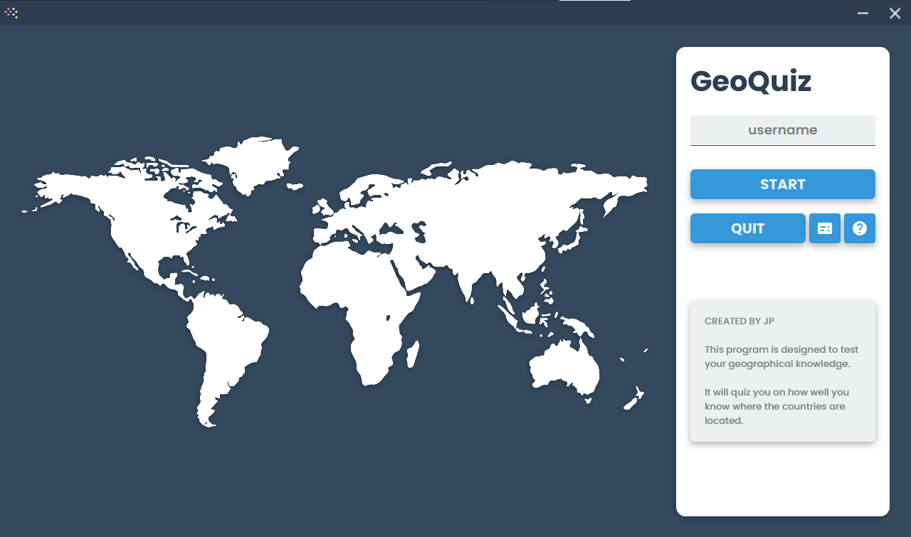

# GeoQuiz

Final project for the **CSCI 1301** - **Software Development** course at **University of Georgia**.

This project is a **GUI JavaFX** application for a simple geography quiz. The user will be able to test they know what continents each countries are located in.

## Demonstration

### Main Page

This is the main interface you will see when you start up the application. 
There are several options that the user can choose, including:
- Click on  button to view help page.
- Click on  button to view the [previous game reports](#GeoQuiz-Report-Page).
- Provide your username in the username field above the `START` button and click `START` button to start the GeoQuiz.

### GeoQuiz Input Page

This is where the user will be prompted to enter the number of countries s/he wants to be tested on.
Once a valid number is inputted, the game begins.

### GeoQuiz Quiz Page

The user will be given a country and 3 continents. 
The goal of the user is to guess the correct continent in which the country in the question is located in.
Once a continent is selected, the user can click on the `NEXT` button to see if s/he got the question correct and move onto the next question.

#### GeoQuiz Question Outcome
Correct | Incorrect
:------:|:---------:
 | 

### GeoQuiz Quiz Result Page

Once the user completes the quiz, this page will be displayed to show how well the user performed on the quiz.

### GeoQuiz Report Page

In this page, the user is able to see the past quiz results. If the user clicks on a specific row, then the user can see what countries s/he guessed correctly or incorrectly.
